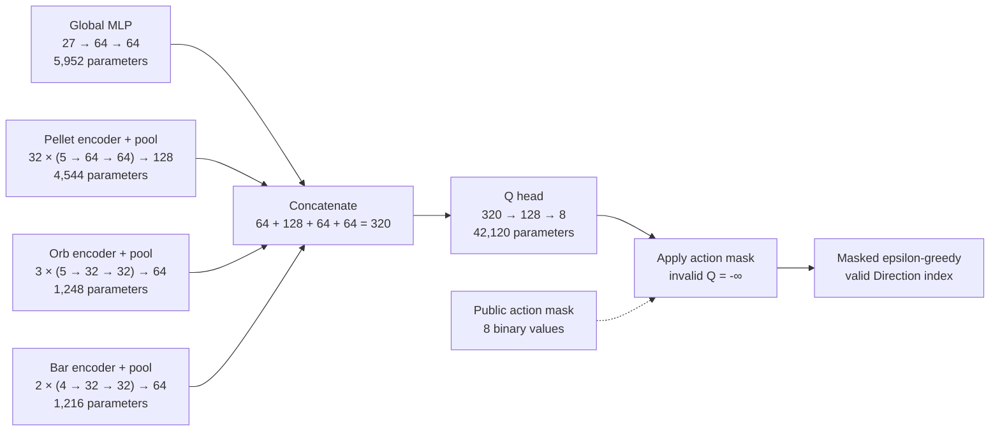

# Neural Sarsa fallback

## Decision gate

Use this design only after the selected linear Sarsa(lambda) configuration
fails the validation gate in [`sarsa.md`](sarsa.md). Tune both agents on seeds
`8000` through `8999`. Run final-test seeds `10000` through `10099` once after
choosing the model family.

The neural agent uses masked, online 5-step Expected Sarsa. It uses no replay
buffer and no true-online eligibility traces. This keeps the update on-policy
while the fallback stays small enough to inspect.

Pin PyTorch in `requirements.txt` before implementation. Do not rely on a
locally installed copy.

## Algorithm and architecture

The network estimates an action-value vector:

```text
Q_theta(s) = [Q_theta(s, a_0), ..., Q_theta(s, a_7)]
```

The update target defines the reinforcement-learning algorithm. The same
encoder and eight-value linear head could support several action-value
algorithms:

| Algorithm | Bootstrap target | Policy relationship |
| --- | --- | --- |
| Sarsa | `r + gamma Q(s', a')` | On-policy |
| Expected Sarsa | `r + gamma sum_a pi(a | s') Q(s', a)` | On-policy when behaviour and target policies match |
| Q-learning / DQN | `r + gamma max_a Q(s', a)` | Off-policy |

This document specifies **Neural Expected Sarsa**: the behaviour policy and
the target policy are the same masked epsilon-greedy policy, and its target
averages the next-state action values under that policy. Reserve replay buffers
and target networks for a separate, explicit off-policy design.

## Public policy state

The network receives only the Gym observation and action mask. It cannot read
`GameSimulation`, an arena object, or unencoded pickup positions.

The action mask has two roles:

- concatenate its eight binary values to the global input because local
  mobility affects value;
- set invalid Q-values to negative infinity during action selection and
  Expected-Sarsa target calculation.

The network returns unmasked Q-values. The policy applies the mask outside the
forward pass.

## Set-based encoder

Pellet, Orb, and bar slot order has no gameplay meaning. Encode each as a set.
Keep object types separate because pellets drive the clear condition and Orbs
start Surge.

| Input | Item features | Encoder and pool |
| --- | --- | --- |
| Pellets | normalized `(x, y)`, player-relative `(dx, dy)`, active | shared 5→64→64 MLP; masked max and active mean |
| Orbs | normalized `(x, y)`, player-relative `(dx, dy)`, active | separate shared 5→32→32 MLP; masked max and active mean |
| Bars | canonicalized endpoint `(x1, y1, x2, y2)` | shared 4→32→32 MLP; max and mean over two bars |

Canonicalize each bar by ordering its endpoints lexicographically, then sort
the two bars lexicographically. Sort active pellets and active Orbs by distance
to the player, then coordinates, before their shared encoders. The sort is not
required for pooling, but it makes test snapshots and debugging stable.

For masked max, replace inactive embeddings with negative infinity. Return a
zero vector when no active item exists. For active mean, divide by
`max(active_count, 1)`. Concatenate the count feature so an empty set differs
from a set whose pooled embeddings sum to zero.

## What this network does

This is a feed-forward action-value network, also called a Q-network. It
estimates `Q(s, a)`: the expected discounted return after choosing direction
`a` in state `s` and then following the masked training policy. It returns
eight values, one for each `Direction`; it does not output action
probabilities.

The architecture combines one global MLP with three Deep Sets-style branches.
Each set branch applies the same MLP to each Pellet, Orb, or bar, then pools
the item embeddings. Reordering objects does not change the pooled result.
That matters because procedural slot order has no gameplay meaning.

The policy layer masks invalid Q-values and then chooses an action. Training
uses the selected Q-value in the online Expected-Sarsa target. The network is
a fallback for the linear Sarsa(lambda) agent, not a replacement for the game
simulation or the action mask.

## Why this uses vector encoders

Orbit Chase supplies a 130-value public state of coordinates, velocities,
timers, object flags, and an action mask. It does not supply a pixel grid.
The global MLP and set encoders match that representation: they read numbers
whose fields have named gameplay meanings.

A convolutional network suits image observations because neighboring pixels
form a spatial grid. It would impose arbitrary local neighborhoods on this
coordinate vector. Frame stacking is unnecessary: player velocity, enemy
heading, and the enemy decision clock expose the short-term motion state used
by the policy.

Use the typed-set encoder as the primary model because Pellet, Orb, and bar
slots have no semantic order. Record a flat 130-value MLP as an ablation.

## Global encoder and Q head

The global vector contains 27 public values:

| Values | Source | Count | Reason |
| --- | --- | ---: | --- |
| Player position, velocity, Surge | observation indices 0–4 | 5 | Tracks movement and current speed advantage. |
| Enemy position, heading, decision clock | observation indices 5–15 | 11 | Tracks the fixed pursuer’s location and next retarget time. |
| Time fraction | observation index 129 | 1 | Distinguishes early collection from end-of-round urgency. |
| Action mask | public `action_mask`, cast to float | 8 | Tells the value head which local moves remain available. |
| Pellet and Orb active fractions | active flags from the two item sets | 2 | Preserves remaining-object counts after pooling. |

The item encoders retain individual Pellet, Orb, and bar geometry. The global
encoder receives only player and enemy state, time, mobility, and counts.

Pass the 27 values through a 27→64→64 MLP. Concatenate its output with the
pellet, Orb, and bar pooled embeddings. Feed the resulting 320 values through
a 320→128→8 MLP with a linear final layer. The eight outputs follow `Direction`
order and may take any real value.

The parameter counts include linear-layer biases:

| Module | Input → output | Trainable parameters |
| --- | --- | ---: |
| Global MLP | `27 → 64 → 64` | 5,952 |
| Pellet encoder | `5 → 64 → 64`, shared across 32 items | 4,544 |
| Orb encoder | `5 → 32 → 32`, shared across 3 items | 1,248 |
| Bar encoder | `4 → 32 → 32`, shared across 2 items | 1,216 |
| Q head | `320 → 128 → 8` | 42,120 |
| **Total** | **8 unmasked Q-values** | **55,080** |



Apply Huber loss to the selected valid action only. Clip global gradient norm
to 10. Initialize AdamW with learning rate `3e-4` and weight decay `1e-5`.
Treat these settings as validation-tunable values.

## Deferred dueling-head ablation

A dueling head splits the final representation into a scalar state-value
stream `V(s)` and an eight-value advantage stream `A(s, a)`, then reconstructs
the action values:

```text
Q(s, a) = V(s) + A(s, a) - mean_a' A(s, a')
```

Subtracting the mean makes the decomposition identifiable. The head changes
the estimator and can train with Expected Sarsa or DQN.

Do not use it in the first neural run. Orbit Chase has eight actions, and no
validation result yet shows that many valid actions have similar values. If a
dueling version is tried, keep the encoder, seed splits, action mask,
optimizer search, and evaluation protocol fixed. Compare it with the ordinary
Q head on validation seeds before a single final-test evaluation.

## Online 5-step Expected Sarsa update

At each decision, sample `a_t` from the masked epsilon-greedy policy based on
`Q_theta(s_t)`. Epsilon decays from 0.20 to 0.02 during training. The lowest
valid action index breaks greedy ties. For a nonterminal bootstrap state,
construct the same masked epsilon-greedy distribution `pi_theta(a | s)` and
compute:

```text
V_theta(s) = sum_a pi_theta(a | s) Q_theta(s, a)
G_t       = r_t + gamma r_(t+1) + ... + gamma^(n-1) r_(t+n-1)
            + gamma^n V_theta(s_(t+n))
```

Use `n = 5` and `gamma = 0.995` per 100 ms decision. Cut the return at a
terminal state and omit its bootstrap term. Detach `G_t` before the Huber loss.

Keep the last five transitions in an episode-local deque. Once the deque has
five rewards, update the oldest state-action pair. Flush the remaining entries
at capture, clear, and timeout. The agent never samples a next action after a
terminal transition.

This is an online control method. Adding replay changes the state-action
distribution and requires a separate off-policy design. If replay becomes
necessary, choose and document Double DQN, Retrace, or another explicit method
before writing the buffer.

## Required tests

Before training, test these properties:

1. Permuting pellet, Orb, or bar order leaves Q-values unchanged.
2. An all-inactive pellet or Orb set produces finite Q-values and no NaNs.
3. Masked epsilon-greedy samples no invalid action and uses uniform exploration
   over valid actions.
4. Terminal capture, clear, and timeout targets omit the bootstrap term.
5. A hand-computed five-step sequence matches the queued update target.
6. The forward pass produces shape `(batch, 8)` and preserves `Direction`
   order.

Log seed ranges, network configuration, optimizer settings, epsilon schedule,
validation metrics, and checkpoints. Compare the chosen neural run with all
three fixed-policy rows and the linear Sarsa agent on the final test only.
